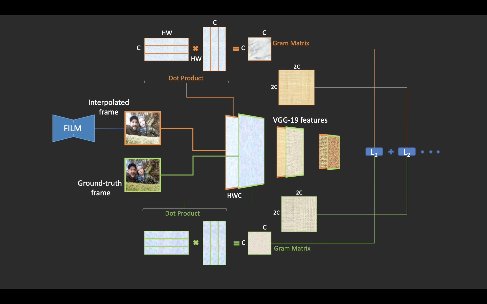

+++
title = "Large Motion Frame Interpolation"
date = "2022-10-08T15:00:00+00:00"
tags = ["review"]
draft = false
author = "Ryan"
+++

[Original Post](https://ai.googleblog.com/2022/10/large-motion-frame-interpolation.html) | [Source Code](https://film-net.github.io/)

# Summary
Frame Interpolation -> temporal upsampling

Motivation: existing algorithms cannot handle those large in-between motion

Related work:
* [SoftSplat](https://arxiv.org/abs/2003.05534)
* [ABME](https://arxiv.org/abs/2108.06815)

Introduced work: [FILM: Frame Interpolation for Large Motion](https://arxiv.org/pdf/2202.04901.pdf)

* Input: two images and outputs a middle image
* Inference: recursively invoke the model to output in-between images.
* Model components: 
    - a multi-scale (pyramid) feature extractor;
    - a bi-directional pixel-wise motion motion estimator at each pyramid level;
    - a fusion module that outputs the final interpolated image
* Dataset: regular video frame triplets, with the middle frame serving as the ground-truth for supervision
* Training:
    - Scale-Agnostic Feature Extraction
    - Bi-directional Flow Estimation
    - Fusion and Frame Generation
* Loss:
    - absolute L1 difference between the predicted and ground-truth frames to capture the motion between input images. Using it alone causes blurs.
    - perceptual loss (VGG loss) to improve image fidelity: min L1 diff ImageNet pre-trained VGG-19 features(predicted and GT frames)
    - style loss: min L2 diff [Gram matrix](https://en.wikipedia.org/wiki/Gram_matrix)(ImageNet pre-trained VGG-19 features

# Takeaways
1. Perceptual loss + style loss can be used to improve image fidelity

